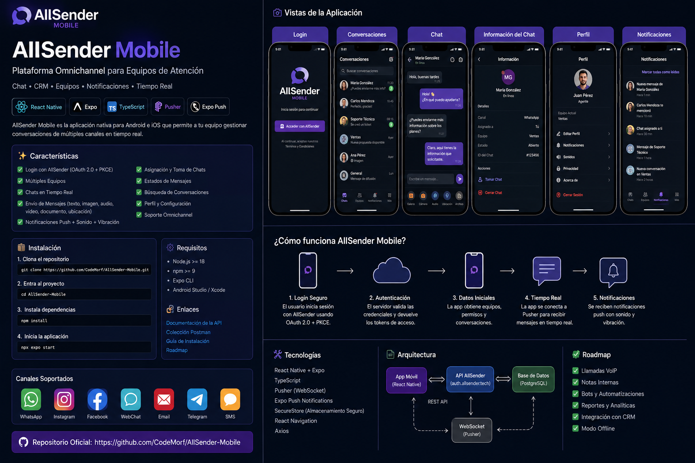

# AllSender Mobile

Aplicación **nativa Android/iOS** para operar conversaciones de AllSender desde el teléfono. Está construida con **React Native + Expo Router** y consume las rutas reales documentadas en la colección Postman incluida en este repositorio.

> **Estado: RC1 — integración móvil funcional sobre API real auditada.**
>
> Esta entrega no se presenta como “Producción Final”. Aún requiere el `client_id` móvil definitivo, `EXPO_PUBLIC_EAS_PROJECT_ID`, QA físico en Android/iOS y la publicación de las capacidades backend de multi-equipo y realtime privado.



> La imagen es una referencia visual de producto. El flujo técnico realmente implementado está documentado en [docs/HOW_IT_WORKS.md](docs/HOW_IT_WORKS.md); no se presentan como activas capacidades de backend que todavía no están publicadas.

## Qué incluye

- Login y registro **nativos** contra AllSender.
- Sesión HttpOnly del SaaS; la contraseña no se guarda en el dispositivo.
- Bandeja de conversaciones con búsqueda y filtro de no leídas.
- Respeto de visibilidad por equipo, agente y sucursal porque la autorización sigue ocurriendo en `auth.allsender.tech`.
- Lectura y envío de mensajes de texto.
- Grabación y envío nativo de notas de voz.
- Toma/asignación de chats.
- Marcado de leído.
- Visualización de imagen, audio, video, documento y ubicación recibidos.
- Integración de los endpoints reales de envío de media/audio/ubicación en `lib/allsender/api.ts`.
- Sincronización automática de foreground contra `/api/chat-mobile/*`.
- Push Expo, sonido y vibración configurables.
- Deep link desde notificaciones hacia la conversación.
- Pantalla de cuenta, equipo y estado de conexión.
- Colección Postman real en `postman/`.

## Arquitectura actual

```text
AllSender Mobile (React Native / Expo)
        |
        | HTTPS + credentials: include
        v
https://auth.allsender.tech
        |
        +-- /api/oauth/consent       -> login/registro + cookie de sesión
        +-- /api/user                -> usuario
        +-- /api/team                -> equipo/rol/plan
        +-- /api/chat-mobile/chats   -> bandeja
        +-- /api/chat-mobile/messages
        +-- /api/chat-mobile/send
        +-- /api/chat-mobile/take-chat
        +-- /api/chats/mark-read
        +-- /api/chat-mobile/sendMedia
        +-- /api/chat-mobile/sendAudio
        +-- /api/chat-mobile/send-location
        +-- /api/mobile/register-device
```

La aplicación **no usa WebView ni PWA**. La interfaz, navegación, sesión local, alertas y chat son React Native.

## Instalación rápida

```bash
git clone https://github.com/CodeMorf/AllSender-Mobile.git
cd AllSender-Mobile
cp .env.example .env
npm install
npx expo start
```

Completa `.env` antes de iniciar:

```env
EXPO_PUBLIC_ALLSENDER_BASE_URL=https://auth.allsender.tech
EXPO_PUBLIC_ALLSENDER_CLIENT_ID=allsender-mobile
EXPO_PUBLIC_ALLSENDER_REDIRECT_URI=allsender://oauth/callback
EXPO_PUBLIC_EAS_PROJECT_ID=TU_EAS_PROJECT_ID
EXPO_PUBLIC_ALLSENDER_SYNC_INTERVAL_MS=2500
```

**Nunca agregues `client_secret` a este repositorio ni al binario móvil.**

Guía completa: [docs/INSTALLATION.md](docs/INSTALLATION.md)

## API real

El cliente usa las rutas auditadas en el Postman entregado, no `/api/mobile/v1` inventados. Consulta:

- [docs/API_REAL.md](docs/API_REAL.md)
- [docs/HOW_IT_WORKS.md](docs/HOW_IT_WORKS.md)
- [docs/VALIDATION.md](docs/VALIDATION.md)
- [postman/AllSender-Mobile-API.postman_collection.json](postman/AllSender-Mobile-API.postman_collection.json)

## Estado

El cliente quedó adaptado al contrato actualmente publicado. Los límites que todavía pertenecen al backend —no a React Native— están separados en [docs/SERVER_GAPS.md](docs/SERVER_GAPS.md) y en el [READMAP](READMAP.md).
